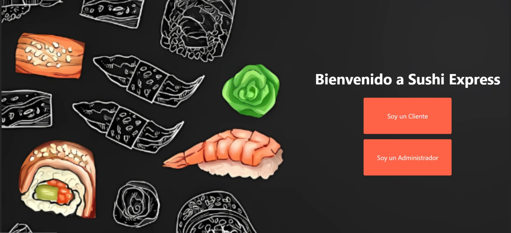
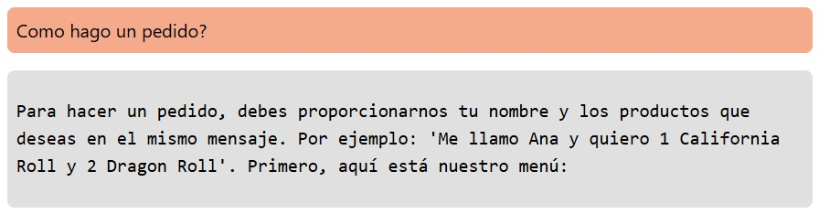
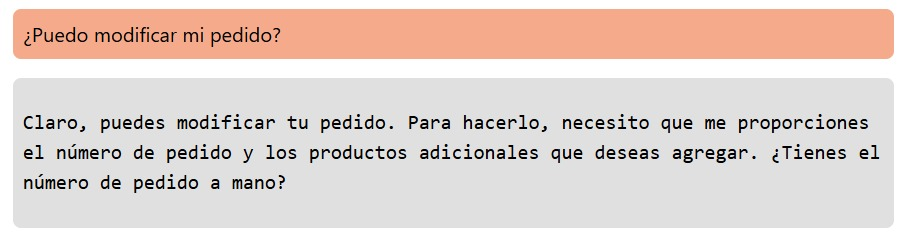
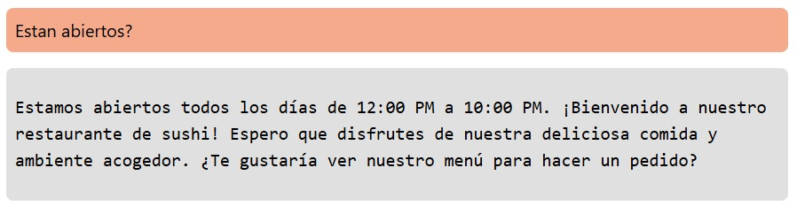
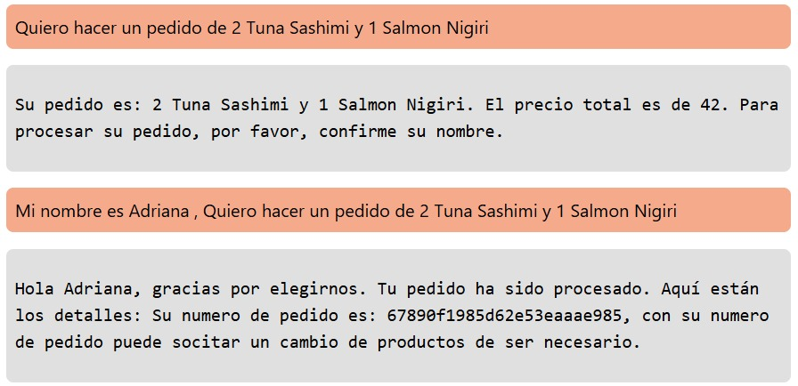
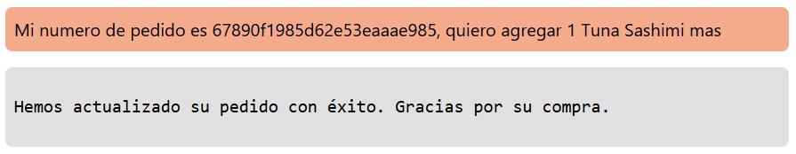

# 🍣 Sushi Chatbot 🍣

## 🌐 Live Deployments
To make it easier for you to test the application, both the frontend and backend have been deployed. Below are the access links:

- **Frontend Deployment**: [https://sushi-chatbot.vercel.app/](https://sushi-chatbot.vercel.app/)
- **Backend Deployment**: The backend is deployed using Docker. Please refer to the instructions below for local setup.
- **MongoDB Database Deployment**: The database is deployed using MongoDB Atlas.

---

## 📌 About this project

This project implements a chatbot for a sushi restaurant. The chatbot allows users to view the menu, place orders, and ask frequently asked questions (FAQs). It is built using Node.js, React, and MongoDB.

- __Back End__: Node.js, Express, MongoDB
- __Front End__: React.js
- __Database__: MongoDB

### 📌 How to get started?

This project requires a `.env` backend and frontend file in the root directory for configuring your database and server.

__Backend:__
File structure for `.env`:
- `DB_URI='your-mongodb-uri'`
- `PORT=5000`

#### ❓ Where do I find this data?
- `DB_URI` is the connection string for your MongoDB database (you can get it from MongoDB Atlas or a local MongoDB instance).
- `PORT` will be the port your server runs on.

__Frontend:__
File structure for `.env`:
- `VITE_API_URL='http://localhost:3000'` (or your live backend URL)

📍 To set up and run the project:

1. In the root directory:
   - Create a `.env` file as explained above.

2. In the `/api` folder:
   - Run `npm install`
   - Run `npm start`

3. In the `/client` folder (optional if you want to set up a front-end):
   - Run `npm install`
   - Run `npm start`

---

## 📸 Interface Screenshot
<div align="center"> 
    </img>
</div>

---

## 📌 API Routes

### ⚡️ `GET /api/faq`
- Retrieves the list of all FAQs.

**Response Example:**
```json
[
    {
        "_id": "6787f101c1eb08aa3b36af7b",
        "question": "¿Cómo hago un pedido?",
        "answer": "Para hacer un pedido, por favor indícanos tu nombre y los productos que deseas pedir en el mismo mensaje. Por ejemplo: 'Me llamo Juan y quiero 2 Tuna Sashimi y 1 Salmon Nigiri'.",
        "__v": 0
    },
    ...
]
```

### ⚡️ `POST /api/faq`
- Retrieves the list of all FAQs.

**Body Example:**
```json
{
  "question": "¿Puedo modificar mi pedido después de hacerlo?",
  "answer": "Sí, puedes agregar más productos a tu pedido. Solo necesitas enviarnos el número de tu pedido junto con los productos adicionales."
}
```

### ⚡️ `PUT /api/faq/:id`
**Body Example:**
```json
{
  "question": "¿Puedo modificar mi pedido después de hacerlo?",
  "answer": "Sí, puedes agregar más productos a tu pedido. Solo necesitas enviarnos el número de tu pedido junto con los productos adicionales."
}
```

### ⚡️ `DELETE /api/faq/:id`

### ⚡️ `GET /api/order`
- Retrieves the details of a specific order.

**Response Example:**
```json
[
  {
        "_id": "678689e4be3bebaaa2bb1e48",
        "client": "Leila Salguero",
        "products": [
            {
                "productId": "6786886a46fbc8a4722a892e",
                "quantity": 2,
                "_id": "678689e4be3bebaaa2bb1e49"
            },
            {
                "productId": "6786888346fbc8a4722a8930",
                "quantity": 1,
                "_id": "678689e4be3bebaaa2bb1e4a"
            }
        ],
        "total": 35,
        "state": "pending",
        "createAt": "2025-01-14T15:59:32.725Z",
        "__v": 0
    },
    ...
]
```

### ⚡️ `POST /api/order`
- Creates a new order.

**Request Body:**
```json
{
  "client": "Juan Pérez",
  "products": [
      { "productId": "Tuna Sashimi", "quantity": 2, "price": 15 },
      { "productId": "Salmon Nigiri", "quantity": 1, "price": 12 }
  ]
}
```

### ⚡️ `GET /api/product`
- Creates a new order.

**Response Example:**
```json
[
  {
    "_id": "67870443803f94f9fa69c9bf",
    "name": "Tuna Sashimi",
    "description": "Fresh slices of tuna served with wasabi and soy sauce.",
    "price": 15,
    "available": true,
    "__v": 0
  },
    ...
]
```

### ⚡️ `POST /api/product`
- Creates a new order.

**Request Body:**
```json
{
  "name": "Dragon Roll",
  "description": "A roll filled with shrimp tempura, avocado, and cucumber, topped with eel and avocado slices.",
  "price": 18.00,
  "available": true
}
```
---

## 📚 Examples of questions answered by the chat

1. **¿Cómo hago un pedido?**


2. **¿Puedo agregar productos a un pedido ya realizado?**


3. **¿Puedo modificar mi pedido?**


4. **¿Estan abiertos?**


5. **Quiero hacer un pedido**
  - The chat will not accept an order if you do not give your name.


6. **¿Tienen opciones vegetarianas?**

  - If you provide the order number you were given when you created it in the chat, you can update it and add more products.


## 🛠 Error Handling

This project uses a custom error handling system that helps manage and respond to errors consistently. The error handling is implemented with middleware and custom error classes to ensure clear, structured responses.

### 🧑‍💻 Error Handler Middleware
The error handler middleware formats and sends a structured error response when an error occurs in the application. It includes details such as:
- **Error Type**: The type of error (e.g., "Invalid ObjectId").
- **Message**: A description of the error.
- **Status Code**: The corresponding HTTP status code (default is 500).

### 🛑 Custom Error Classes
The application defines specific error classes that extend a base `AppError` class. These classes are used to handle particular error scenarios:
- **InvalidObjectIdError**: For invalid ObjectId format errors (e.g., wrong ID format in requests).
- **MissingFieldsError**: For missing required fields in the request.
- **NotFoundError**: For cases where a resource (e.g., user or product) is not found.

## 🧪 Running Tests

This project uses Jest for testing. Here's how you can run the tests for controllers and routes:

Make sure you have all dependencies installed. If you haven't installed them yet, you can run:

```json
npm install
```

Then, to run the tests, use the following command:

```json
  npm test
```